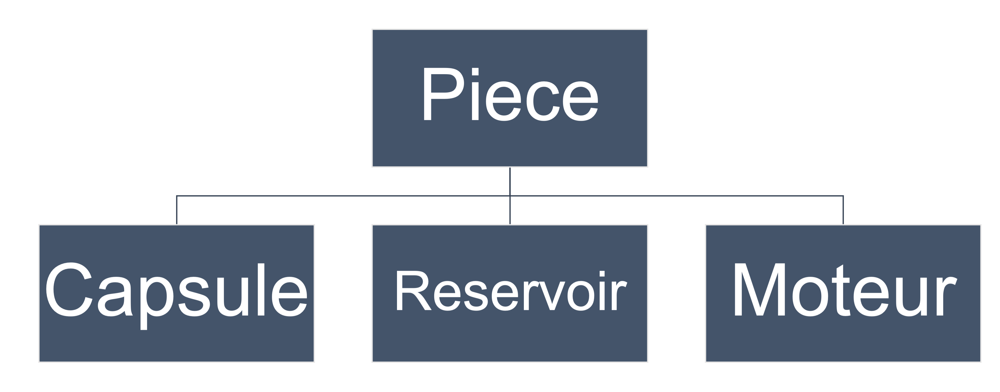
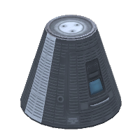
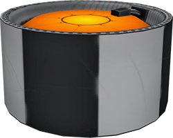
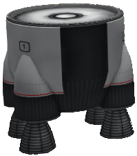
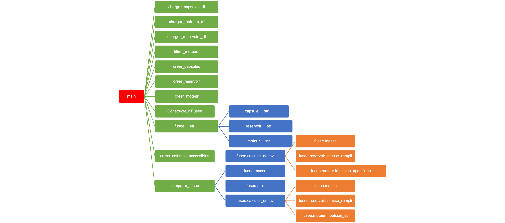
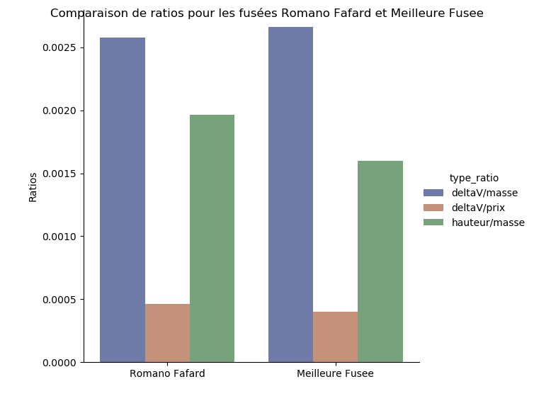

# Projet 3: Lectures de fichier, Bibliothèques scientifiques et graphiques, Programmation orientée objet
> :alarm_clock: [Date de remise: 28 novembre à 23h59](https://www.timeanddate.com/countdown/launch?iso=20211128T2359&p0=165&msg=INF1007+-+A21+-+Remise+Projet+3&font=cursive&csz=1)


Poly Space Program [0]

## Table des matières

- [Objectif](#objectif)
- [Directives particulières](#directives-particulières)
- [Énoncé du travail](#énoncé-du-travail)
- [Modèle](#modèle)
  - [Pièce](#pièce)
    - [Capsule](#capsule)
    - [Réservoir](#réservoir)
    - [Moteur](#moteur)
  - [Fusée](#fusée)
- [Modules à implanter](#modules-à-implanter)
  - [Module fichiers pièces](#module-fichiers-pièces)
    - [`charger_capsules_df(chemin_capsules: str) -> pd.DataFrame`](#charger_capsules_dfchemin_capsules-str---pddataframe)
    - [`charger_reservoirs_df(chemin_reservoirs: str) -> pd.DataFrame`](#charger_reservoirs_dfchemin_reservoirs-str---pddataframe)
    - [`charger_moteurs_df(chemin_moteurs: str) -> pd.DataFrame`](#charger_moteurs_dfchemin_moteurs-str---pddataframe)
    - [`filtrer_moteurs(moteurs_df: pd.DataFrame, impulsion_minimum: int) -> pd.DataFrame`](#filtrer_moteursmoteurs_df-pddataframe-impulsion_minimum-int---pddataframe)
  - [Module fusée](#module-fusée)
    - [Réservoir: `masse_rempli(self) -> float`](#réservoir-masse_rempliself---float)
    - [Fusée: constructeur](#fusée-constructeur)
    - [Fusée: `masse(self) -> float`](#fusée-masseself---float)
    - [Fusée: `hauteur(self) -> float`](#fusée-hauteurself---float)
    - [Fusée: `prix(self) -> float`](#fusée-prixself---float)
    - [Fusée: `__str__(self) -> str`](#fusée-__str__self---str)
    - [Fusée: `calculer_deltav(self) -> float`](#fusée-calculer_deltavself---float)
  - [Module assemblage](#module-assemblage)
    - [`creer_capsules(capsules_df: str) -> List[Capsule]`](#creer_capsulescapsules_df-str---listcapsule)
    - [`creer_moteurs(moteurs_df: str) -> List[Moteur]`](#creer_moteursmoteurs_df-str---listmoteur)
    - [`creer_reservoirs(reservoirs_df: str) -> List[Reservoir]`](#creer_reservoirsreservoirs_df-str---listreservoir)
    - [`corps_celestes_accessibles(fusee: Fusee) -> List[str]`](#corps_celestes_accessiblesfusee-fusee---liststr)
    - [`comparer_fusee(fusee_1: Fusee, fusee_2: Fusee) -> None`](#comparer_fuseefusee_1-fusee-fusee_2-fusee---none)
  - [Module principal](#module-principal)
    - [`main() -> Tuple[Fusee, Fusee]`](#main---tuplefusee-fusee)
- [Barème](#barème)
- [Annexe: Guide et normes de codage](#annexe-guide-et-normes-de-codage)
- [Sources](#sources)


## Objectif

* Affuter votre savoir-faire en gestion de fichiers
* Pratiquer votre gestion de Dataframes
* Vous familiariser avec les notions de programmation orientée objet
* Présenter vos résultats sous forme de graphiques
* Intégrer les bonnes pratiques de programmation dans votre code

## Directives particulières

* Respecter le [guide de codage](https://github.com/INF1007-Gabarits/Guide-codage-python) et les normes pep8
* Noms de variables et fonctions adéquats (concis, compréhensibles)
* Pas de librairies externes autres que celles déjà importées
* Dans chaque programme, vous pouvez ajouter d’autres fonctions à celles décrites dans l’énoncé pour améliorer la
  lisibilité

## Énoncé du travail

Le cosmos vous fascine. Depuis les exploits stellaires fort médiatisés de milliardaires extravagants, vous croyez qu'il
est maintenant à votre tour d'écrire dans le grand livre d'histoire de l'humanité en construisant votre propre fusée.
Avant de penser au décompte et au bruit sourd des moteurs, vous avez le réflexe, en tant que futur·e ingénieur·e, de
simuler préalablement le bon fonctionnement de votre engin spatial.

En étudiant le marché, vous découvrez le (très sérieux)
simulateur [Kerbal Space Program](https://www.kerbalspaceprogram.com/). Cependant, celui-ci n'est pas assez rigoureux
pour vos ambitions. Avec vos nouvelles connaissances en programmation, vous souhaitez améliorer ce dernier pour mettre
au monde le meilleur simulateur spatial qui soit : Poly Space Program.

Votre simulateur est composé de quatre modules à compléter :

|     Module      |                                                       Description                                                        |
|-----------------|--------------------------------------------------------------------------------------------------------------------------|
| Fichiers Pièces | Module responsable de la lecture des spécifications des différentes pièces disponibles pour construire votre fusée       |
| Fusée           | Module décrivant les classes Fusée, Pièce, Capsule, Réservoir et Moteur                                                  |
| Assemblage      | Module responsable de la création de la fusée et des objets qui la composent et de la comparaison entre différentes fusées |
| Principal       | Module intégrant toutes les autres parties de votre code                                                                 |

## Modèle

### Pièce

Classe de base abstraite regroupant les attributs communs pour toutes les pièces.

| Attribut | Visibilité |  Type   |           Description            |
|----------|------------|---------|----------------------------------|
| nom      | Public     | `str`   | Le nom de la pièce               |
| hauteur  | Public     | `float` | La hauteur de la pièce en mètres |
| masse    | Public     | `float` | La masse de la pièce en kg       |
| prix     | Public     | `float` | Le prix de la pièce en $CAN      |


La classe Pieces et ses classes filles

#### Capsule

> Classe mère : Pièce

##### Description

Classe représentant une capsule de contrôle pour votre fusée.



Une capsule à une place [1]

##### Attributs

| Attribut | Visibilité |  Type   |                             Description                              |
|----------|------------|---------|----------------------------------------------------------------------|
| nom      | Public     | `str`   | Le nom de la pièce                                                   |
| hauteur  | Public     | `float` | La hauteur de la pièce en mètres                                     |
| masse    | Public     | `float` | La masse de la pièce en kg                                           |
| prix     | Public     | `float` | Le prix de la pièce en $CAN                                          |
| places   | Public     | `int`   | Le nombre de places disponibles dans la capsule pour les astronautes |

#### Réservoir

> Classe mère : Pièce

##### Description

Classe représentant un réservoir de carburant pour votre fusée.



Un réservoir de hauteur moyenne [2]

##### Attributs

| Attribut | Visibilité |  Type   |            Description             |
|----------|------------|---------|------------------------------------|
| nom      | Public     | `str`   | Le nom de la pièce                 |
| hauteur  | Public     | `float` | La hauteur de la pièce en mètres   |
| masse    | Public     | `float` | La masse de la pièce vide en kg    |
| prix     | Public     | `float` | Le prix de la pièce en $CAN        |
| capacité | Public     | `float` | La capacité de carburant en litres |

#### Moteur

> Classe mère : Pièce

Classe représentant un moteur pour votre fusée.



Un gros moteur [3]


|       Attribut       | Visibilité |  Type   |                                                  Description                                                   |
|----------------------|------------|---------|----------------------------------------------------------------------------------------------------------------|
| nom                  | Public     | `str`   | Le nom de la pièce                                                                                             |
| hauteur              | Public     | `float` | La hauteur de la pièce en mètres                                                                               |
| masse                | Public     | `float` | La masse de la pièce en kg                                                                                     |
| prix                 | Public     | `float` | Le prix de la pièce en $CAN                                                                                    |
| impulsion spécifique | Public     | `int`   | L'[impulsion spécifique](https://fr.wikipedia.org/wiki/Impulsion_sp%C3%A9cifique) de votre moteur en secondes. |

### Fusée

#### Description

Classe représentant votre fusée. Il s'agit d'une fusée simple (mais redoutable) composée de :

* 1x capsule
* 1x réservoir
* 1x moteur

#### Attributs

| Attribut  | Visibilité |    Type     |                Description                |
|-----------|------------|-------------|-------------------------------------------|
| nom       | Public     | `str`       | Le nom de la fusée                        |
| capsule   | **Privé**  | `Capsule`   | La capsule à assembler dans votre fusée   |
| reservoir | **Privé**  | `Reservoir` | Le réservoir à assembler dans votre fusée |
| moteur    | **Privé**  | `Moteur`    | Le moteur à assembler dans votre fusée    |

## Modules à implanter



Arbre d'appel des fonctions

### Module fichiers pièces

Dans le fichier `fichiers_pieces.py`, complétez les fonctions suivantes :

#### `charger_capsules_df(chemin_capsules: str) -> pd.DataFrame`

##### Description

Charge les capsules contenues dans le fichier `capsules.csv` dans un dataframe.

Malheureusement, la compagnie fabriquant les capsules ne suit pas de bonnes pratiques de nommage. C'est à vous de
renommer les colonnes du dataframe pour obtenir quelque chose de plus lisible et conforme.

Nous nous attendons aux noms suivants :

| Nom original | Nom attendu |
|--------------|-------------|
| n            | nom         |
| h            | hauteur     |
| m            | masse       |
| p            | prix        |
| pl           | places      |

**N.B. Utilisez la constante `FICHIER_CAPSULE` dans l'implantation de la fonction.**

##### Paramètres

* **chemin_capsules** (str) : Une chaine de caractères du chemin vers le dossier capsules

##### Valeur de retour

* Type : `pd.DataFrame`
* Description : Le Dataframe des capsules avec les bons noms de colones

##### Exemple

```python
from constantes import CHEMIN_CAPSULES
# ...
capsules = charger_capsules_df(CHEMIN_CAPSULES)
print(capsules)
```

```
           nom  hauteur  masse  prix  capacite
0  PasDBonSens      1.5    840   600       1.0
1         Mini      2.0   3250  1515       2.0
2  SpaceLounge      3.0  10000  3900       3.5
```

#### `charger_reservoirs_df(chemin_reservoirs: str) -> pd.DataFrame`

##### Description

Charge les réservoirs contenus dans les fichiers `reservoir*.json` dans un dataframe.

La compagnie fabriquant les réservoirs a séparé les différents modèles en fichiers json individuels. C'est à vous de les
combiner dans un seul dataframe de sortie.

**N.B. Utilisez la constante `FICHIERS_RESERVOIRS` dans l'implantation de la fonction.**

##### Paramètres

* **chemin_reservoirs** (str) : Une chaine de caractères du chemin vers le dossier reservoirs

##### Valeur de retour

* Type : `pd.DataFrame`
* Description : Le Dataframe combiné des réservoirs

##### Exemple

```python
from constantes import CHEMIN_RESERVOIRS
# ...
reservoirs = charger_reservoirs_df(CHEMIN_RESERVOIRS)
print(reservoirs)
```

```
            nom  hauteur  masse   prix  capacite
0  Bain Magique      1.0    500    800       360
1       Jacuzzi      2.5   3570   3250      1620
2       Piscine     25.0   9000  13000      6480
```

#### `charger_moteurs_df(chemin_moteurs: str) -> pd.DataFrame`

##### Description

Charge les moteurs contenus dans les fichiers `moteur*.ppl` dans un dataframe.

Les moteurs sont fabriqués par la compagnie Poly Propulsion Laboratory (absolument rien à voir
avec [JPL](https://www.jpl.nasa.gov/)). Voulant tout faire à sa manière, PPL utilise un type de fichier qui leur est
propre pour décrire leurs moteurs.

Voici un exemple:

```text
# Commentaire. À ignorer lors de la lecture
nom=<Nom du moteur (chaine de caractères)>
hauteur=<Hauteur du moteur (un chiffre après la virgule)>

# Il peut y avoir autant de lignes vides que voulu. Elles n'ont pas d'importance à la lecture.

masse=<Masse du moteur (un chiffre après la virgule)>
prix=<Prix du moteur (deux chiffres après la virgule)>
impulsion specifique=<Impulsion spécifique du moteur (entier)>
```

C'est à vous d'écrire le code pouvant extraire les informations des fichiers PPL et de les combiner dans un seul
dataframe de sortie.

**N.B. Utilisez la constante `FICHIERS_MOTEURS` dans l'implantation de la fonction.**

##### Paramètres

* **chemin_moteurs** (str) : Une chaine de caractères du chemin vers le dossier moteurs

##### Valeur de retour

* Type : `pd.DataFrame`
* Description : Le Dataframe combiné des moteurs

##### Exemple

```python
from constantes import CHEMIN_MOTEURS
# ...
moteurs = charger_moteurs_df(CHEMIN_MOTEURS)
print(moteurs)
```

```
            nom  hauteur    masse     prix  impulsion specifique
0      Tondeuse      0.5     20.0    110.0                    80
1    Civic VTEC      2.0   3000.0   2968.0                   205
2  VelociRAPTOR      4.0   2000.0   6000.0                   250
3  La Puissance     12.0  15000.0  39000.0                   295
```

#### `filtrer_moteurs(moteurs_df: pd.DataFrame, impulsion_minimum: int) -> pd.DataFrame`

##### Description

Nous voulons aller vers l'infini et plus loin encore ! Il est donc impératif de bien sélectionner nos moteurs. La
fonction retourne un dataframe de moteurs filtré où l'impulsion spécifique des éléments contenus est au-dessus d'un
certain seuil.

##### Paramètres

* **moteurs_df** (pd.DataFrame) : Le dataframe de moteurs à filtrer
* **impulsion_minimum** (int) : L'impulsion spécifique minimum désirée

##### Valeur de retour

* Type : `pd.DataFrame`
* Description : Le Dataframe filtré de moteurs

##### Exemple

```python
moteurs = charger_moteurs_df()
moteurs_filtres = filtrer_moteurs(moteurs, 220)
print(moteurs_filtres)
```

```
            nom  hauteur    masse     prix  impulsion specifique
0  VelociRAPTOR      4.0   2000.0   6000.0                   250
1  La Puissance     12.0  15000.0  39000.0                   295
```

### Module fusée

Dans le fichier `fusee.py`, complétez les méthodes suivantes :

#### Réservoir: `masse_rempli(self) -> float`

##### Description

Retourne la masse du réservoir rempli de carburant.

**N.B. Utilisez la constante `MASSE_VOLUMIQUE_CARBURANT` pour vos calculs.**

##### Paramètres

* **self (`Reservoir`)** : Une référence au réservoir duquel la masse remplie doit être calculée

##### Valeur de retour

* Type : `float`
* Description : La masse du réservoir rempli de carburant

##### Exemple

```python
reservoir = Reservoir("Pichet", 0.4, 0.5, 20, 2)
masse_rempli = reservoir.masse_rempli
print(f"Une fois rempli, {reservoir.nom} a une masse de {masse_rempli} kg")
```

```
Une fois rempli, Pichet a une masse de 10.5 kg
```

#### Fusée: constructeur

##### Description

Vous devez implanter le constructeur pour les objets de type `Fusee`. Fiez-vous au [modèle](#Fusée) de la classe pour
plus d'information.

##### Paramètres

* **nom (`str`)** : Le nom de la fusée
* **capsule (`Capsule`)** : La capsule à assembler dans votre fusée
* **reservoir (`Reservoir`)** : Le réservoir à assembler dans votre fusée
* **moteur (`Moteur`)** : Le moteur à assembler dans votre fusée

##### Valeur de retour

Aucune

##### Exemple

```python
# Définition des pièces omise pour simplifier l'exemple
fusee = Fusee("Romano Fafard", capsule, reservoir, moteur)
print(f"fusee est de type {type(fusee)}")
```

```
fusee est de type <class 'fusee.Fusee'>
```

#### Fusée: `masse(self) -> float`

##### Description

Retourne la masse totale d'un objet `Fusee`. Il s'agit de la somme des masses des pièces.

##### Paramètres

* **self (`Fusee`)** : Une référence à la fusée

##### Valeur de retour

* Type : `float`
* Description : La masse totale de l'objet `Fusee`

##### Exemple

```python
capsule = Capsule("Exigüe", 1.0, 750, 1300.0, 1)
reservoir = Reservoir("Pichet", 0.4, 0.5, 20.0, 2)
moteur = Moteur("Pantera Arctic Cat Triple 800", 4, 2000, 14000.0, 199)
fusee = Fusee("Romano Fafard", capsule, reservoir, moteur)
print(f"La masse de la fusée {fusee.nom} est {fusee.masse}kg")
```

```
La masse de la fusée Romano Fafard est 2850.5kg
```

#### Fusée: `hauteur(self) -> float`

##### Description

Retourne la hauteur totale d'un objet `Fusee`. Il s'agit de la somme des hauteurs des pièces.

##### Paramètres

* **self (`Fusee`)** : Une référence à la fusée

##### Valeur de retour

* Type : `float`
* Description : La hauteur totale de l'objet `Fusee`

##### Exemple

```python
capsule = Capsule("Exigüe", 1.0, 750, 1300.0, 1)
reservoir = Reservoir("Pichet", 0.4, 0.5, 20.0, 2)
moteur = Moteur("Pantera Arctic Cat Triple 800", 4, 2000, 14000.0, 199)
fusee = Fusee("Romano Fafard", capsule, reservoir, moteur)
print(f"La hauteur de la fusée {fusee.nom} est {fusee.hauteur}m")
```

```
La hauteur de la fusée Romano Fafard est 5.4m
```

#### Fusée: `prix(self) -> float`

##### Description

Retourne le prix total d'un objet `Fusee`. Il s'agit de la somme du prix des pièces.

##### Paramètres

* **self (`Fusee`)** : Une référence à la fusée

##### Valeur de retour

* Type : `float`
* Description : Le prix total de l'objet `Fusee`

##### Exemple

```python
capsule = Capsule("Exigüe", 1.0, 750, 1300.0, 1)
reservoir = Reservoir("Pichet", 0.4, 0.5, 20.0, 2)
moteur = Moteur("Pantera Arctic Cat Triple 800", 4, 2000, 14000.0, 199)
fusee = Fusee("Romano Fafard", capsule, reservoir, moteur)
print(f"Le prix de la fusée {fusee.nom} est {fusee.prix}$")
```

```
Le prix de la fusée Romano Fafard est 15320.0$
```

#### Fusée: `__str__(self) -> str`

##### Description

Retourne la représentation en `str` d'un objet `Fusee`. À noter qu'il s'agit d'une seule `str` avec des
tabulations (`\t`) et sauts de ligne (`\n`).

##### Paramètres

* **self (`Fusee`)** : Une référence à la fusée à représenter en `str`

##### Valeur de retour

* Type : `str`
* Description : La représentation en `str` de l'objet `Fusee`.

##### Exemple

```python
capsule = Capsule("Exigüe", 1.0, 750, 1300.0, 1)
reservoir = Reservoir("Pichet", 0.4, 0.5, 20.0, 2)
moteur = Moteur("Pantera Arctic Cat Triple 800", 4, 2000, 14000.0, 199)
fusee = Fusee("Romano Fafard", capsule, reservoir, moteur)
print(fusee)
```

```
Fusée:
	Nom: Romano Fafard
	Hauteur totale: 5.4m
	Masse totale (remplie): 2850.5kg
	Prix total: 15320.0$
Pièces:
	Capsule: Exigüe, hauteur=1.0m, masse=750kg, prix=1300.0$, places=1 personne(s)
	Réservoir: Pichet, hauteur=0.4m, masse=0.5kg, prix=20.0$, capacité=2L
	Moteur: Pantera Arctic Cat Triple 800, hauteur=4m, masse=2000kg, prix=14000.0$, impulsion spécifique=199s
```

#### Fusée: `calculer_deltav(self) -> float`

##### Description

Retourne le deltaV d'un objet `Fusee`.

Selon [Wikipedia](https://fr.wikipedia.org/wiki/Delta-v):
> En astronautique, le Delta-v est notamment utilisé pour estimer la quantité de propergol qui est nécessaire pour accomplir une manœuvre, un changement de trajectoire, pour décoller d'une planète, se placer en orbite d'un corps céleste en venant du sol ou de l'espace interplanétaire, pour échapper à l'attraction d'un objet (Terre, Soleil...).

Le deltaV, exprimé en m/s, peut être calculé à l'aide de
l'[équation de Tsiolkovski](https://fr.wikipedia.org/wiki/%C3%89quation_de_Tsiolkovski):


où:

* **Isp** (s): Impulsion spécifique du moteur
* **m rempli** (kg): La masse de la fusée remplie de carburant
* **m vide** (kg): La masse de la fusée sans carburant
* **9.81** (m/s^2): La constante gravitationnelle moyenne sur Terre

##### Paramètres

* **self (`Fusee`)** : Une référence à la fusée

##### Valeur de retour

* Type : `float`
* Description : Le deltaV de l'objet `Fusee`

##### Exemple

```python
capsule = Capsule("Exigüe", 1.0, 750, 1300.0, 1)
reservoir = Reservoir("Pichet", 0.4, 0.5, 20.0, 2)
moteur = Moteur("Pantera Arctic Cat Triple 800", 4, 2000, 14000.0, 199)
fusee = Fusee("Romano Fafard", capsule, reservoir, moteur)

# Faible deltaV puisqu'un pichet de carburant n'est pas suffisant pour explorer l'univers
delta_v = fusee.calculer_deltav()
print(f"Le deltaV de la fusée {fusee.nom} est {delta_v:.2f}m/s")
```

```
Le deltaV de la fusée Romano Fafard est 69.72m/s
```

### Module assemblage

Dans le fichier `assemblage.py`, complétez les fonctions suivantes :

#### `creer_capsules(capsules_df: str) -> List[Capsule]`

##### Description

Crée une liste d'objets `Capsule` à partir d'un dataframe.

##### Paramètres

* **capsules_df** : Un dataframe contenant des informations sur des capsules

##### Valeur de retour

* Type : `List[Capsule]`
* Description : Une liste d'objets de type `Capsule`

##### Exemple

```python
from constantes import CHEMIN_CAPSULES
capsules_df = charger_capsules_df(CHEMIN_CAPSULES)
capsules = creer_capsules(capsules_df)
for capsule in capsules:
    print(capsule)
```

```text
Capsule: PasDBonSens, hauteur=1.5m, masse=840.0kg, prix=600.0$, places=1 personne(s)
Capsule: Mini, hauteur=2.0m, masse=3250.0kg, prix=1515.0$, places=2 personne(s)
Capsule: SpaceLounge, hauteur=3.0m, masse=10000.0kg, prix=3900.0$, places=4 personne(s)
```

#### `creer_moteurs(moteurs_df: str) -> List[Moteur]`

##### Description

Crée une liste d'objets `Moteur` à partir d'un dataframe.

##### Paramètres

* **moteurs_df** : Un dataframe contenant des informations sur des moteurs

##### Valeur de retour

* Type : `List[Moteur]`
* Description : Une liste d'objets de type `Moteur`

##### Exemple

```python
from constantes import CHEMIN_MOTEURS
moteurs_df = charger_moteurs_df(CHEMIN_MOTEURS)
moteurs_df = filtrer_moteurs(moteurs_df, 270)
moteurs = creer_moteurs(moteurs_df)
for moteur in moteurs:
    print(moteur)
```

```text
Moteur: La Puissance, hauteur=12.04m, masse=15000.0kg, prix=39000.0$, impulsion spécifique=295s
```

#### `creer_reservoirs(reservoirs_df: str) -> List[Reservoir]`

##### Description

Crée une liste d'objets `Reservoir` à partir d'un dataframe.

##### Paramètres

* **reservoirs_df** : Un dataframe contenant des informations sur des réservoirs

##### Valeur de retour

* Type : `List[Reservoir]`
* Description : Une liste d'objets de type `Reservoir`

##### Exemple

```python
from constantes import CHEMIN_RESERVOIRS
reservoirs_df = charger_reservoirs_df(CHEMIN_RESERVOIRS)
reservoirs = creer_reservoirs(reservoirs_df)
print(reservoirs[0])
```

```text
Réservoir: Bain Magique, hauteur=1.0m, masse=500.0kg, prix=800.0$, capacité=360L
```

#### `corps_celestes_accessibles(fusee: Fusee) -> List[str]`

##### Description

Retourne la liste des corps célestes accessibles par la fusée.
Un corps céleste est accessible si le deltaV de la fusée est supérieur à celui requis pour se rendre à l'astre.

La constante `DELTA_V_MINIMUM_PAR_CORPS_CELESTE` sert de référence pour le deltaV requis par corps céleste.

| Corps céleste | DeltaV minimum |
|---------------|----------------|
| Mercure       |           8361 |
| Vénus         |           4501 |
| Mars          |           4711 |
| Jupiter       |           5471 |
| Saturn        |           5969 |
| Uranus        |           6467 |
| Neptune       |           6965 |
| Pluton        |           7461 |

##### Paramètres

* **fusee** : La fusée en question

##### Valeur de retour

* Type : `List[str]`
* Description : Une liste des corps célestes accessibles par la fusée

##### Exemple

```python
capsule = Capsule("PasDBonSens", 1.5, 840.0, 600.0, 1)
reservoir = Reservoir("Piscine", 25.0, 9000.0, 13000.00, 6480.0)
moteur = Moteur("La Puissance", 12.0, 15000.0, 39000.00, 295)
fusee = Fusee("Romano Fafard", capsule, reservoir, moteur)

deltaV = fusee.calculer_deltav()
corps_celestes = corps_celestes_accessibles(fusee)
print(f"La fusée {fusee.nom} peut aller, avec {deltaV:.2f} de deltaV, jusqu'à: {corps_celestes}")
```

```text
La fusée Romano Fafard peut aller, avec 7646.27 de deltaV, jusqu'à: [Vénus, Mars, Jupiter, Saturn, Uranus, Neptune, Pluton]
```

#### `comparer_fusee(fusee_1: Fusee, fusee_2: Fusee) -> None`

##### Description

Affiche un graphique de comparaison entre deux fusées. Un « [grouped barplot](https://seaborn.pydata.org/examples/grouped_barplot.html) » est préféré. 
Les ratios sont placés en y, les fusées en x et on veut comparer leurs performances selon le type de ratio. Veuillez voir l'exemple ci-dessous de l'affichage voulu pour le graphique.

Voici les métriques à afficher pour chaque fusée :
* deltaV par rapport à la masse
* deltaV par rapport au prix
* hauteur par rapport à la masse

##### Paramètres

* **fusee_1** : La première fusée à comparer
* **fusee_2** : La deuxième fusée à comparer

##### Valeur de retour

Aucune

##### Exemple

```python
# Définition des fusées est omise pour simplifier l'exemple
comparer_fusee(fusee_1, fusee_2)
```


Exemple de graphique de comparaison entre deux fusées

### Module principal

Dans le fichier `main.py`, complétez la fonction suivante :

#### `main() -> Tuple[Fusee, Fusee]`

##### Description

Fonction principale du programme. 
Les différentes étapes à suivre sont exprimées en commentaires TODO à même la fonction.

##### Paramètres

Aucun

##### Valeur de retour

* Type : `Tuple[Fusee, Fusee]`
* Description : Un tuple des deux fusées créées par l'utilisateur

## Barème

|    Fonctions / Méthodes    | Points attribués |
|----------------------------|------------------|
| charger_capsules_df        | 3                |
| charger_reservoirs_df      | 3                |
| charger_moteurs_df         | 4                |
| filtrer_moteurs            | 2                |
| Réservoir: masse_rempli    | 1                |
| Fusée: constructeur        | 2                |
| Fusée: masse               | 1                |
| Fusée: hauteur             | 1                |
| Fusée: prix                | 1                |
| Fusée: __str__             | 3                |
| Fusée: calculer_deltav     | 3                |
| creer_capsules             | 2                |
| creer_moteurs              | 2                |
| creer_reservoirs           | 2                |
| corps_celestes_accessibles | 2                |
| comparer_fusee             | 4                |
| main                       | 4                |
| **Total**                  | / 40             |

La qualité du code sera corrigée, mais ne compte pas dans le barème.

## Annexe: Guide et normes de codage

- [Le guide maison](https://github.com/INF1007-Gabarits/Guide-codage-python) de normes supplémentaires à respecter
- [Le plugin Pycharm Pylint](https://plugins.jetbrains.com/plugin/11084-pylint) qui analyse votre code et indique
  certaines erreurs.
- [Quelques indications en français sur PEP8](https://openclassrooms.com/fr/courses/4425111-perfectionnez-vous-en-python/4464230-assimilez-les-bonnes-pratiques-de-la-pep-8)
- [La documentation PEP8 officielle](https://www.python.org/dev/peps/pep-0008/)

## Sources

[0] https://store-images.s-microsoft.com/image/apps.56855.13990179641465130.86bf7337-d8e3-40cc-90da-25933a41a5f6.81fa7650-3ad1-45b8-b3d7-781f83ff2fbd?mode=scale&q=90&h=1080&w=1920&format=jpg

[1] https://wiki.kerbalspaceprogram.com/wiki/File:Kerbodyne_S3-3600_Tank.png

[2] https://wiki.kerbalspaceprogram.com/wiki/File:Mk1CommandPod_Dark.png

[3] https://wiki.kerbalspaceprogram.com/wiki/File:Quad.png